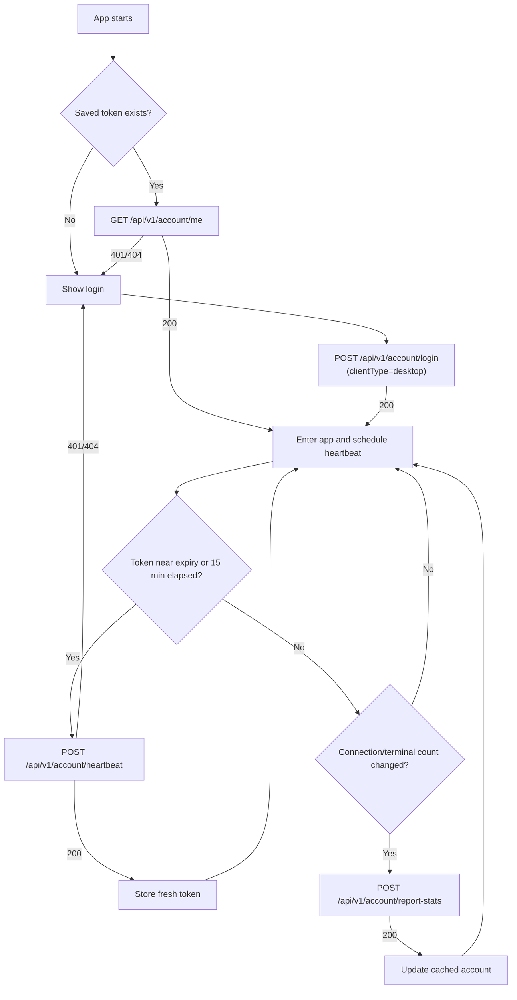

# JLShell Client Auth API

This document is for the JLShell desktop client agent that implements website
account login, session keepalive, and logout.

## Base URL

Production example:

```text
https://jlshell.oomn.net
```

All protected requests use:

```http
Authorization: Bearer <token>
```

The token is a JWT issued by the website backend. Treat it as a secret.

## Login

```http
POST /api/v1/account/login
Content-Type: application/json
```

Request:

```json
{
  "username": "alice",
  "password": "user password",
  "captchaToken": "optional-captcha-token",
  "captchaAnswer": "12",
  "clientType": "desktop"
}
```

`username` can be a username or email address.
`captchaToken` and `captchaAnswer` are only required after the server starts
requiring captcha for this username.
`clientType` is optional and must be `"desktop"` or `"web"`. Defaults to `"web"`
if omitted. The desktop client **should** pass `"desktop"` so the server can
track client type in login history and online session data.

Response `200`:

```json
{
  "token": "eyJhbGciOiJIUzI1NiJ9...",
  "expiresAt": "2026-07-02T12:00:00Z",
  "account": {
    "id": "7cfe1f88-0f95-4b7d-b4b9-55f1d4415b5f",
    "username": "alice",
    "email": "alice@example.com",
    "role": "user",
    "passwordChangeRequired": false,
    "connectionCount": 0,
    "terminalCount": 0
  }
}
```

Failure:

- `401`: wrong username/password.
- `401`: captcha is required or invalid.
- `403`: request was authenticated but not allowed for that resource.

Client behavior:

- Store `token`, `expiresAt`, and `account` in the local profile.
- Store the token in the OS secure store when available.
- Do not log the token.
- If login fails, call `/api/v1/account/captcha?username=<username>` and show
  the returned challenge when `required=true`.

## Captcha Challenge

```http
GET /api/v1/account/captcha?username=alice
```

Response when captcha is not required:

```json
{
  "required": false,
  "token": null,
  "question": null
}
```

Response when captcha is required:

```json
{
  "required": true,
  "token": "f600a0f4-9aa5-4f6d-a887-98dd5d3402a0",
  "question": "7 + 8 = ?"
}
```

Recommended client behavior:

- Do not show captcha on the first login attempt.
- After any login failure, call this endpoint.
- When `required=true`, render the question and include `captchaToken` and
  `captchaAnswer` in the next login request.
- Refresh the captcha after another login failure.

## Register

```http
POST /api/v1/account/register
Content-Type: application/json
```

Request:

```json
{
  "username": "alice",
  "email": "alice@example.com",
  "password": "user password"
}
```

Response is the same shape as login.

Failure:

- `409`: username or email already exists.

## Current Account

```http
GET /api/v1/account/me
Authorization: Bearer <token>
```

Response `200`:

```json
{
  "id": "7cfe1f88-0f95-4b7d-b4b9-55f1d4415b5f",
  "username": "alice",
  "email": "alice@example.com",
  "role": "user",
  "passwordChangeRequired": false,
  "connectionCount": 0,
  "terminalCount": 0
}
```

Use this after app startup to validate a saved token.

If `passwordChangeRequired=true`, block admin-only workflows and show a password
change form first.

## Change Password

```http
POST /api/v1/account/password
Authorization: Bearer <token>
Content-Type: application/json
```

Request:

```json
{
  "oldPassword": "current password",
  "newPassword": "new password"
}
```

Response `200`:

```json
{
  "id": "7cfe1f88-0f95-4b7d-b4b9-55f1d4415b5f",
  "username": "alice",
  "email": "alice@example.com",
  "role": "admin",
  "passwordChangeRequired": false,
  "connectionCount": 0,
  "terminalCount": 0
}
```

Client behavior:

- Require the user to confirm the new password locally before sending.
- Minimum password length is 8 characters.
- When the response returns `passwordChangeRequired=false`, update the cached
  account and unlock the normal console flow.

## Heartbeat / Token Renewal

```http
POST /api/v1/account/heartbeat
Authorization: Bearer <token>
```

Response is the same shape as login and contains a fresh token:

```json
{
  "token": "eyJhbGciOiJIUzI1NiJ9...",
  "expiresAt": "2026-07-02T20:00:00Z",
  "account": {
    "id": "7cfe1f88-0f95-4b7d-b4b9-55f1d4415b5f",
    "username": "alice",
    "email": "alice@example.com",
    "role": "user",
    "passwordChangeRequired": false,
    "connectionCount": 0,
    "terminalCount": 0
  }
}
```

Recommended client strategy:

- On startup, call `/api/v1/account/me` with the saved token.
- If the saved token is accepted, schedule heartbeat.
- Refresh when `expiresAt` is less than 30 minutes away.
- Also heartbeat every 15 minutes while the app is active.
- Replace the stored token atomically after heartbeat succeeds.
- If heartbeat returns `401`, clear the token and show the login screen.
- If the app is offline, keep the current token and retry when network returns.

The server does not revoke the old token during heartbeat. This avoids breaking
in-flight requests. The old token expires naturally.

## Report Stats

```http
POST /api/v1/account/report-stats
Authorization: Bearer <token>
Content-Type: application/json
```

Request:

```json
{
  "connectionCount": 3,
  "terminalCount": 2
}
```

Response `200`:

```json
{
  "id": "7cfe1f88-0f95-4b7d-b4b9-55f1d4415b5f",
  "username": "alice",
  "email": "alice@example.com",
  "role": "user",
  "passwordChangeRequired": false,
  "connectionCount": 3,
  "terminalCount": 2
}
```

The desktop client should call this endpoint to report its current connection
and terminal counts. Recommended strategy:

- Call after login once the app has established its connections.
- Call whenever the connection or terminal count changes (new tab opened,
  connection added/removed).
- Call periodically (e.g. every 5 minutes) as a keep-alive for the online
  session data in addition to heartbeat.
- Both `connectionCount` and `terminalCount` must be ≥ 0.

This endpoint updates the `connectionCount` and `terminalCount` shown on the
user's profile page, as well as the online session data in Redis.

## Logout

```http
POST /api/v1/account/logout
Authorization: Bearer <token>
```

Response:

```http
200 OK
```

Client behavior:

- Call logout when the user explicitly signs out.
- Clear the stored token and cached account after a successful logout.
- If logout fails because the network is offline, still clear the local token.

## Error Handling

Authentication errors use JSON:

```json
{
  "error": "unauthorized",
  "message": "Authentication required or token invalid"
}
```

Client handling:

- `401`: token missing, expired, revoked, or invalid. Clear token and request login.
- `403`: token is valid but the account lacks permission. Keep token, show an access denied message.
- `404` on `/me` or `/heartbeat`: account no longer exists. Clear token and request login.

## Minimal Client Flow


