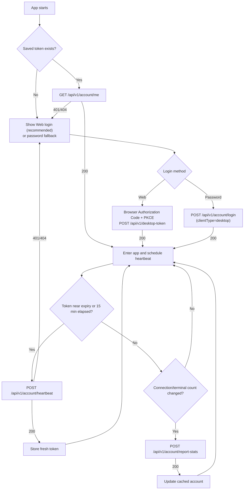
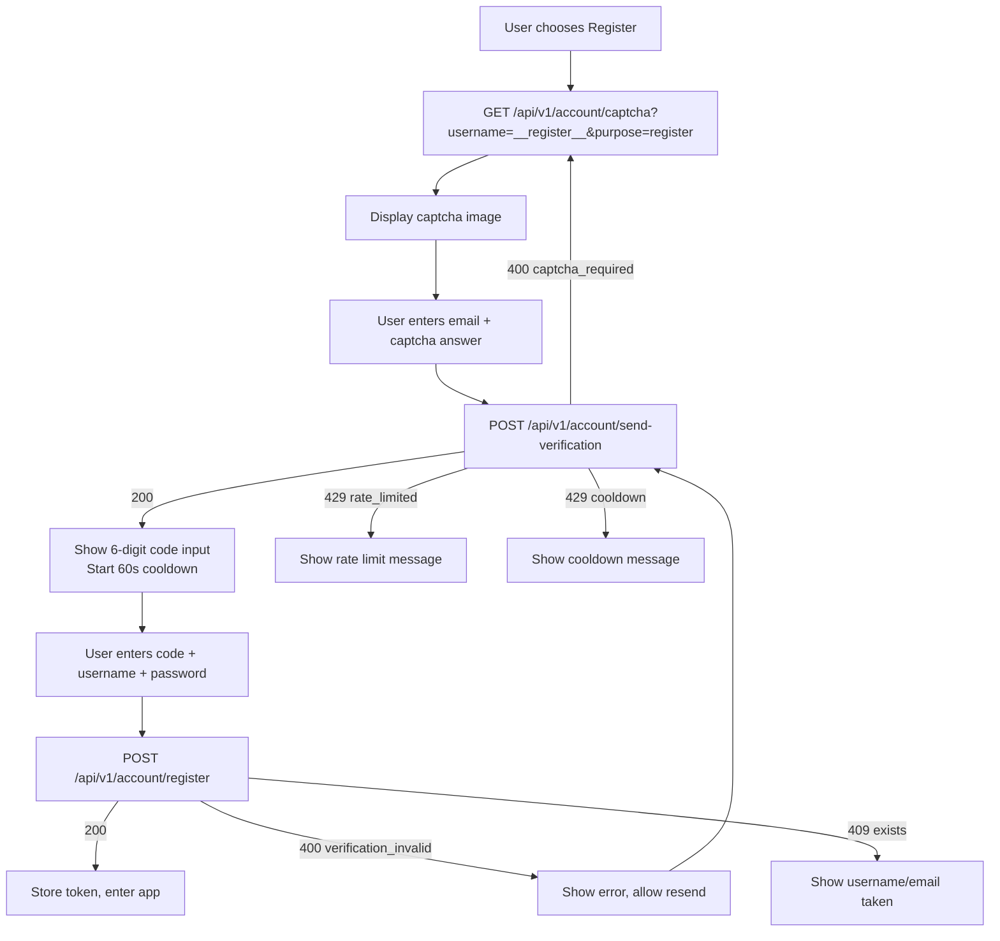

# JLShell Client Auth API

This document is for the JLShell desktop client agent that implements website
account login, session keepalive, and logout.

## Base URL

Production example:

```text
https://jlshell.oomn.net
```

All protected requests use:

```http
Authorization: Bearer <token>
```

The token is a JWT issued by the website backend. Treat it as a secret.

## Browser Login (recommended)

The desktop client generates a PKCE S256 verifier/challenge and a random
`state`, then starts a temporary HTTP listener bound only to `127.0.0.1`.
It opens the system browser at:

```text
/desktop/authorize?code_challenge=...&redirect_uri=http%3A%2F%2F127.0.0.1%3APORT%2Fcallback&state=...&device_id=...&device_name=...
```

The website performs password, captcha, and MFA checks in the browser. After
the user approves the device, the website redirects a single-use authorization
code to the exact loopback URI. The client validates `state` and exchanges the
code with the original verifier:

```http
POST /api/v1/desktop-token
Content-Type: application/json

{
  "code": "single-use-code",
  "codeVerifier": "original-pkce-verifier",
  "redirectUri": "http://127.0.0.1:49152/callback"
}
```

The response uses the same desktop `AuthResponse` shape documented below.
Authorization codes expire quickly and cannot be reused. Browser cookies never
leave the browser, and the desktop client never receives the user's password.

## Password Login (fallback)

```http
POST /api/v1/account/login
Content-Type: application/json
```

Request:

```json
{
  "username": "alice",
  "password": "user password",
  "captchaToken": "optional-captcha-token",
  "captchaAnswer": "12",
  "clientType": "desktop",
  "deviceId": "a1b2c3d4-e5f6-7890-abcd-ef1234567890",
  "deviceName": "Alice-PC"
}
```

`username` can be a username or email address.
`captchaToken` and `captchaAnswer` are only required after the server starts
requiring captcha for this username.
`clientType` is optional and must be `"desktop"` or `"web"`. Defaults to `"web"`
if omitted. The desktop client **should** pass `"desktop"` so the server can
track client type in login history and online session data.
`deviceId` is a client-generated UUID that uniquely identifies this device.
Generate it on first launch and persist it locally — it should never change
for the same installation. The server uses it to track unique devices over time
(for device limit enforcement and historical statistics).
`deviceName` is an optional human-readable device name (e.g. hostname).
The server stores it for display in the account console.

Response `200`:

```json
{
  "token": "eyJhbGciOiJIUzI1NiJ9...",
  "expiresAt": "2026-07-02T12:00:00Z",
  "account": {
    "id": "7cfe1f88-0f95-4b7d-b4b9-55f1d4415b5f",
    "username": "alice",
    "email": "alice@example.com",
    "role": "user",
    "passwordChangeRequired": false,
    "connectionCount": 0,
    "terminalCount": 0,
    "historicalDeviceCount": 1
  }
}
```

Failure:

- `401` with `error: "invalid_credentials"`: wrong username/password.
- `401` with `error: "captcha_required"`: captcha is required but missing or invalid.
- `403` with `error: "forbidden"`: request was authenticated but not allowed for that resource.

Client behavior:

- Store `expiresAt` and non-sensitive account metadata in the local profile.
- Store the token only in the AES-GCM encrypted host secure-settings service.
- Migrate the legacy plain `account.authToken` value once and immediately
  remove the plain setting.
- Do not log the token.
- If login fails, call `/api/v1/account/captcha?username=<username>` and show
  the returned challenge when `required=true`.

## Captcha Challenge

```http
GET /api/v1/account/captcha?username=alice
```

Optional `purpose` parameter:

```http
GET /api/v1/account/captcha?username=__register__&purpose=register
```

When `purpose=register`, the server always generates a captcha challenge
regardless of login failure count. Use this before calling
`POST /api/v1/account/send-verification` for registration.

Response when captcha is not required:

```json
{
  "required": false,
  "token": null,
  "question": null,
  "imageBase64": null
}
```

Response when captcha is required:

```json
{
  "required": true,
  "token": "f600a0f4-9aa5-4f6d-a887-98dd5d3402a0",
  "question": null,
  "imageBase64": "data:image/png;base64,iVBORw0KGgo..."
}
```

The captcha is now rendered as a PNG image with visual noise and character
distortion. The `imageBase64` field contains a data URI that can be displayed
directly in an `` tag or equivalent image view. The `question` field is
`null` when `imageBase64` is present; for backward compatibility, if
`imageBase64` is absent, fall back to displaying `question` as text.

Recommended client behavior:

- Do not show captcha on the first login attempt.
- After any login failure, call this endpoint.
- When `required=true`, display the `imageBase64` image and include
  `captchaToken` and `captchaAnswer` in the next login request.
- Refresh the captcha after another login failure.
- Add a "refresh captcha" button so users can get a new image if it is
  unreadable.

## Register

```http
POST /api/v1/account/register
Content-Type: application/json
```

Registration now requires email verification. The flow is:

1. Call `GET /api/v1/account/captcha?username=__register__&purpose=register`
   to get a captcha challenge.
2. Call `POST /api/v1/account/send-verification` to send a 6-digit code to
   the user's email.
3. Call `POST /api/v1/account/register` with the verification code.

### Send Verification Code

```http
POST /api/v1/account/send-verification
Content-Type: application/json
```

Request:

```json
{
  "email": "alice@example.com",
  "captchaToken": "captcha-token-from-step-1",
  "captchaAnswer": "15"
}
```

Response `200`: verification code sent successfully (empty body).

Failure:

- `400` with `error: "captcha_required"`: captcha verification failed.
- `429` with `error: "verification_rate_limited"`: too many requests from this IP (max 3 per minute).
- `429` with `error: "verification_cooldown"`: a code was recently sent to this email (wait 60 seconds).
- `503` with `error: "email_send_failed"`: email delivery failed, try again later.

Rate limits:

- **IP rate limit**: max 3 verification emails per IP per minute.
- **Email cooldown**: 60 seconds between sending codes to the same email address.
- **Code expiry**: 5 minutes. The code is single-use — any verification attempt
  (correct or not) invalidates it.

Client behavior:

- After sending, start a 60-second countdown before allowing resend.
- On resend, fetch a new captcha first (the previous one was consumed).
- Display the 6-digit input field only after a code has been sent.

### Complete Registration

```http
POST /api/v1/account/register
Content-Type: application/json
```

Request:

```json
{
  "username": "alice",
  "email": "alice@example.com",
  "password": "user password",
  "verificationCode": "123456"
}
```

`verificationCode` is **required** — the 6-digit code received via email.

Response is the same shape as login.

Failure:

- `400` with `error: "verification_invalid"`: verification code is wrong, expired, or not sent.
- `409` with `error: "username_exists"`: username already taken.
- `409` with `error: "email_exists"`: email already registered.

## Current Account

```http
GET /api/v1/account/me
Authorization: Bearer <token>
```

Response `200`:

```json
{
  "id": "7cfe1f88-0f95-4b7d-b4b9-55f1d4415b5f",
  "username": "alice",
  "email": "alice@example.com",
  "role": "user",
  "passwordChangeRequired": false,
  "connectionCount": 0,
  "terminalCount": 0,
  "historicalDeviceCount": 1
}
```

Use this after app startup to validate a saved token.

If `passwordChangeRequired=true`, block admin-only workflows and show a password
change form first.

## Change Password

```http
POST /api/v1/account/password
Authorization: Bearer <token>
Content-Type: application/json
```

Request:

```json
{
  "oldPassword": "current password",
  "newPassword": "new password"
}
```

Response `200`:

```json
{
  "id": "7cfe1f88-0f95-4b7d-b4b9-55f1d4415b5f",
  "username": "alice",
  "email": "alice@example.com",
  "role": "admin",
  "passwordChangeRequired": false,
  "connectionCount": 0,
  "terminalCount": 0,
  "historicalDeviceCount": 1
}
```

Client behavior:

- Require the user to confirm the new password locally before sending.
- Minimum password length is 8 characters.
- When the response returns `passwordChangeRequired=false`, update the cached
  account and unlock the normal console flow.

## Heartbeat / Token Renewal

```http
POST /api/v1/account/heartbeat
Authorization: Bearer <token>
```

Response is the same shape as login and contains a fresh token:

```json
{
  "token": "eyJhbGciOiJIUzI1NiJ9...",
  "expiresAt": "2026-07-02T20:00:00Z",
  "account": {
    "id": "7cfe1f88-0f95-4b7d-b4b9-55f1d4415b5f",
    "username": "alice",
    "email": "alice@example.com",
    "role": "user",
    "passwordChangeRequired": false,
    "connectionCount": 0,
    "terminalCount": 0,
    "historicalDeviceCount": 1
  }
}
```

Recommended client strategy:

- On startup, call `/api/v1/account/me` with the saved token.
- If the saved token is accepted, schedule heartbeat.
- Refresh when `expiresAt` is less than 30 minutes away.
- Also heartbeat every 15 minutes while the app is active.
- Replace the stored token atomically after heartbeat succeeds.
- If heartbeat returns `401`, clear the token and show the login screen.
- If the app is offline, keep the current token and retry when network returns.

The server does not revoke the old token during heartbeat. This avoids breaking
in-flight requests. The old token expires naturally.

## Report Stats

```http
POST /api/v1/account/report-stats
Authorization: Bearer <token>
Content-Type: application/json
```

Request:

```json
{
  "connectionCount": 3,
  "deviceId": "a1b2c3d4-e5f6-7890-abcd-ef1234567890"
}
```

Response `200`:

```json
{
  "id": "7cfe1f88-0f95-4b7d-b4b9-55f1d4415b5f",
  "username": "alice",
  "email": "alice@example.com",
  "role": "user",
  "passwordChangeRequired": false,
  "connectionCount": 3,
  "terminalCount": 2,
  "historicalDeviceCount": 3
}
```

The desktop client should call this endpoint to report its current SSH
connection count. `deviceId` is optional but recommended — it allows the
server to update the device's last-known IP address.

The `terminalCount` (online device count) is calculated automatically by
the server from active sessions. The `historicalDeviceCount` is the total
number of unique devices ever seen for this account.

Recommended strategy:

- Call after login once the app has established its connections.
- Call whenever the connection count changes (new tab opened,
  connection added/removed).
- Call periodically (e.g. every 5 minutes) as a keep-alive for the online
  session data in addition to heartbeat.
- `connectionCount` must be ≥ 0.

This endpoint updates the `connectionCount` shown on the user's profile
page, as well as the online session data in Redis. The `terminalCount`
field in the response reflects the number of active login sessions for
this user (across all devices), which can be used for device limit
enforcement.

## Logout

```http
POST /api/v1/account/logout
Authorization: Bearer <token>
```

Response:

```http
200 OK
```

Client behavior:

- Call logout when the user explicitly signs out.
- Clear the stored token and cached account after a successful logout.
- If logout fails because the network is offline, still clear the local token.

## Error Handling

All error responses use a consistent JSON format:

```json
{
  "error": "error_code",
  "message": "Human-readable description"
}
```

The `error` field is a machine-readable code. The `message` field is a
human-readable description (in English). Client implementations should
map `error` codes to localized user-facing messages.

### Error Codes

| Code | HTTP Status | Meaning |
|------|-------------|---------|
| `invalid_credentials` | 401 | Wrong username or password |
| `captcha_required` | 400/401 | Captcha verification failed or is required |
| `verification_invalid` | 400 | Email verification code is wrong or expired |
| `verification_rate_limited` | 429 | Too many verification requests from this IP |
| `verification_cooldown` | 429 | Verification code was recently sent to this email |
| `email_send_failed` | 503 | Email delivery failed |
| `username_exists` | 409 | Username is already registered |
| `email_exists` | 409 | Email is already registered |
| `validation` | 400 | Request validation failed (check field constraints) |
| `unauthorized` | 401 | Token missing, expired, revoked, or invalid |
| `forbidden` | 403 | Account lacks the required role |
| `account_not_found` | 404 | Account no longer exists |
| `internal` | 500 | Server internal error |

Client handling:

- `401` with `unauthorized` or `invalid_credentials`: clear token and request login.
- `401` with `captcha_required`: fetch a new captcha and show it.
- `403`: token is valid but the account lacks permission. Keep token, show an access denied message.
- `404` on `/me` or `/heartbeat`: account no longer exists. Clear token and request login.
- `429`: rate limited. Show a message and suggest waiting.
- `503`: service temporarily unavailable. Suggest retrying later.

## Minimal Client Flow



### Registration Flow


